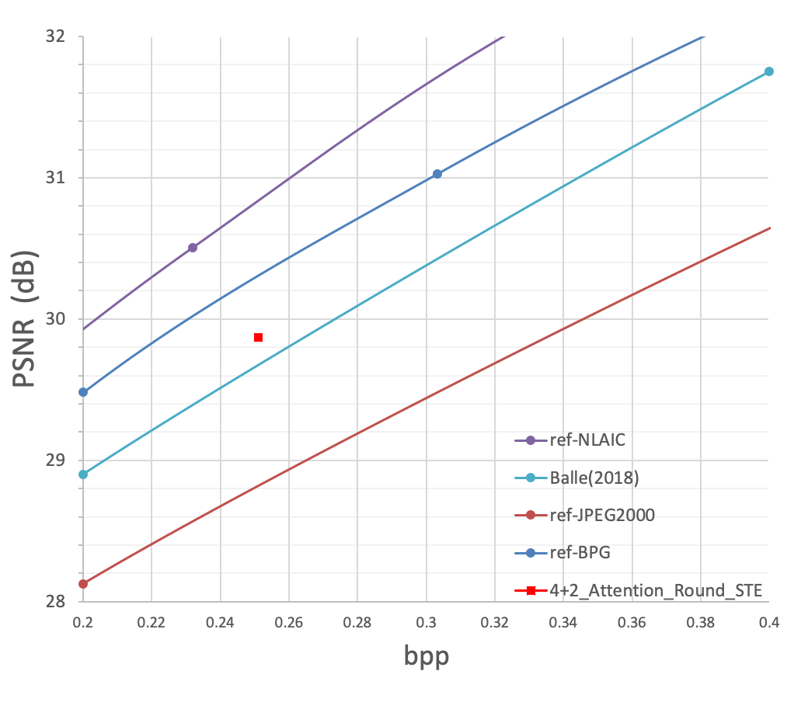

# Release note

## tag - channel-attention 
3 Up/Downsamples in Main & 1 Up/Downsamples in Hyper Coder with channel attention for Main encoder's output.
Download link for pre-trained model: http://yun.nju.edu.cn/f/3d8f298c2f/?raw=1

## tag - channel-attention-4+2-Round_STE
4 Up/Downsamples in Main & 2 Up/Downsamples in Hyper Coder with channel attention for Main encoder's output.
Download link for pre-trained model: http://yun.nju.edu.cn/f/63aae44182/?raw=1

    # Train (change lr (learning rate) in train_v100.py for finetuning)
    python train_v100.py --chip 2803 --train_batch_size 16

    # Test on Kodak datasets
    python test_kodak.py/test_kodak_batch.py --chip 2803

Performance on Kodak dataset compared with several baseline:

